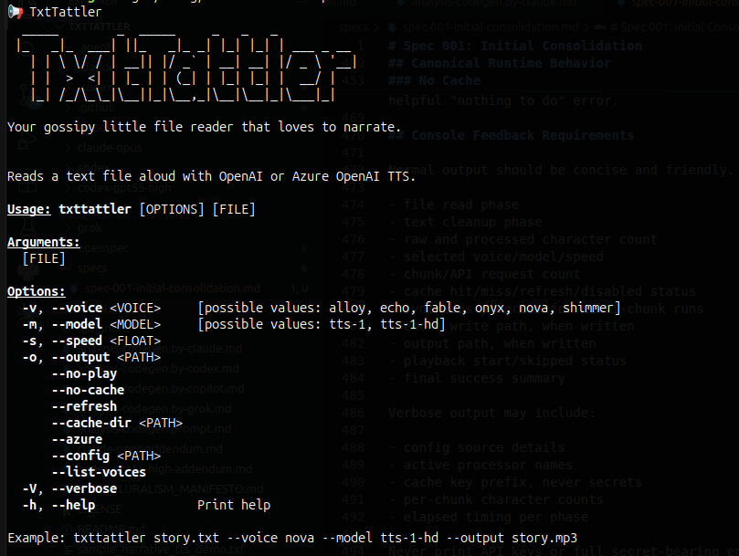

# TxtTattler — AI Code Generation Comparative Study

This repository is a comparative study of six independent Rust implementations of the same application, each generated by a different AI coding assistant from an identical prompt.

> **This is not a "best model" competition.**
> One prompt, one application domain, one reviewer — none of that generalises to a verdict on any AI tool's overall capability. The goal is not to declare a winner. It is to learn: where do AI code generators follow a demanding spec faithfully, where do they cut corners, and which architectural decisions get consistently right or consistently wrong? Read the analysis documents to understand *why* each implementation lands where it does; treat any ranking as a starting point for that conversation, not as a conclusion.

---

## About This Study

### The Prompt

All six implementations were generated from the same specification: [`txttattler-creation-prompt.md`](txttattler-creation-prompt.md). The spec is deliberately demanding — it defines not only the external CLI contract but also internal architecture (hexagonal / ports & adapters), caching strategy (content-addressed SHA-256, atomic writes), text-processing middleware (composable, injectable pipeline), configuration precedence (CLI > env > file > default), encoding requirements (UTF-8 BOM, UTF-16, error surfacing), and several Rust-quality expectations (idiomatic types, dependency hygiene, testability, clean entry point).

The same prompt was submitted to each tool. No follow-up prompting, steering, or corrections were applied after the initial generation.

### The Implementations

Each subdirectory contains a fully working, independently generated Rust project:

| Directory | Generated by |
| --------- | ----------- |
| `claude/` | Claude Sonnet 4.7 (Anthropic) |
| `claude-opus/` | Claude Opus 4.7 (Anthropic) |
| `codex/` | Codex  GPT-4.4 Medium (OpenAI) |
| `codex-gpt55-high/` | Codex GPT-5.5 High (OpenAI) |
| `ghcopilot/` | GitHub Copilot Auto - (Microsoft)|
| `grok/` | Grok Build (xAI) |

All six implementations compile and run. They share the same CLI contract and external behaviour, but differ substantially in architecture, code quality, and adherence to the specification.

### Methodology

Each implementation was evaluated independently against the same structured rubric defined in [`analysis-codegen.prompt.md`](analysis-codegen.prompt.md). Every verdict is evidence-based: claims cite specific file paths, line numbers, and code snippets. General praise or criticism without a concrete reference is not accepted.

**Rubric areas:**

| Area | What is checked |
| ---- | --------------- |
| 1.1 CLI interface | Required flags, `required_unless_present`, parse-time validation, banner |
| 1.2 Architecture | Ports & adapters, trait placement, no infrastructure leakage into use-case |
| 1.3 Config precedence | CLI > env > file > default; explicit-default ambiguity trap |
| 1.4 Caching | Content-addressed key, null-byte separators, atomic writes, refresh/no-cache |
| 1.5 Text chunking | Paragraph → sentence → word → character hierarchy, limit respected |
| 1.6 Text processing | Composable injectable middleware, stable `name()` for cache versioning |
| 1.7 OpenAI / Azure | Both providers, auto-detection, configurable API version |
| 1.8 Encoding | UTF-8 BOM, UTF-16 LE/BE, encoding errors as visible failures |
| 1.9 Output & feedback | Reporter port, progress bar, phase labels |
| 2.1 Idiomatic types | Enums with `FromStr`/`Display`/`Serde`, `Option<T>` CLI args |
| 2.2 Dependency hygiene | Current versions, no unused deps, correct dev-dep placement |
| 2.3 Dead code & logic | No noop guards, no silent discards, no TODO in production paths |
| 2.4 Testability | Injectable ports, silent reporter, cache-reuse integration test |
| 2.5 Test coverage | Entity parsing, chunker, cache key, processors, file reader, config |
| 2.6 Entry-point | `main.rs` ≤ ~50 lines, no raw I/O or env reads in `main` |

Each criterion is marked ✓ (correct/present), ✗ (absent/wrong), or Partial.

### The Analysis Documents

The initial four-way analysis is in:

- [`analysis-codegen.by-claude.md`](analysis-codegen.by-claude.md)
- [`analysis-codegen.by-codex.md`](analysis-codegen.by-codex.md)
- [`analysis-codegen.by-ghcopilot.md`](analysis-codegen.by-ghcopilot.md)
- [`analysis-codegen.by-grok.md`](analysis-codegen.by-grok.md)

Two follow-up addenda extend the study to six implementations:

- [`claude-opus-addendum.md`](claude-opus-addendum.md) — analysis of Claude Opus + five-way comparison
- [`codex-gpt55-high-addendum.md`](codex-gpt55-high-addendum.md) — analysis of Codex GPT-5.5 High + six-way comparison and final ranking

### Six-Way Scorecard

| Criterion | Codex | Grok | Claude | GHCopilot | Claude Opus | GPT-5.5 High |
| --------- | :---: | :--: | :----: | :-------: | :---------: | :----------: |
| 1.1 CLI interface | Partial | Partial | ✗ | ✓ | Partial | ✓ |
| ASCII art banner | ✗ | Partial | ✗ | ✓ | ✓ | ✓ |
| `required_unless_present` | ✗ | ✓ | ✗ | ✓ | ✗ | ✓ |
| Parse-time voice/model validation | ✓ | Partial | ✗ | ✓ | ✗ | ✓ |
| Parse-time speed validation | ✓ | ✗ | ✗ | ✓ | ✗ | ✓ |
| 1.2 Domain ports complete | Partial | Partial | Partial | Partial | Partial | Partial |
| `ProgressReporter` port | ✗ | ✗ | ✗ | ✓ | ✓ | ✗ |
| `FileReaderRegistry` in domain | ✗ | ✓ | ✗ | ✗ | ✗ | ✗ |
| 1.3 Config file TTS options honoured | ✗ | ✗ | ✗ | Partial | ✗ | ✗ |
| Correct env > config for keys | ✓ | ✗ | ✗ | ✓ | ✗ | ✓ |
| 1.4 Null-byte cache separators | ✓ | ✗ | ✗ | ✓ | ✓ | ✓ |
| Atomic cache writes | ✗ | ✓ | ✗ | ✗ | ✗ | ✓ |
| Atomic output writes | ✗ | ✗ | ✗ | ✗ | ✗ | ✓ |
| 1.5 Sentence-boundary chunking | ✓ | Partial | Partial | ✓ | ✓ | ✗ |
| Word-level chunking | ✓ | ✗ | ✗ | ✓ | ✗ | ✓ |
| Character fallback | ✗ | Partial | ✓ | ✓ | ✓ | ✓ |
| Chunk limit tested | ✓ | ✗ | ✓ | ✓ | ✓ | ✓ |
| 1.6 Composable processor chain | ✓ | ✗ | ✗ | ✓ | ✗ | ✗ |
| Processor `name()` | ✗ | ✗ | ✗ | ✓ | ✗ | ✗ |
| 1.7 Azure API version configurable | ✓ | ✓ | ✗ | ✓ | ✓ | ✓ |
| Auto-Azure detection (exact spec) | ✗ | ✗ | ✗ | ✓ | ✗ | ✗ |
| 1.8 UTF-16 support | ✗ | ✗ | ✗ | ✓ | ✗ | ✗ |
| Encoding errors surfaced | ✓ | ✗ | ✗ | ✓ | ✗ | ✗ |
| 1.9 Reporter port | ✗ | ✗ | ✗ | ✓ | ✓ | ✗ |
| 2.1 `Serialize`/`Deserialize` on entities | ✗ | ✓ | ✗ | ✓ | ✗ | ✓ |
| `FromStr` on entities | ✗ | ✓ | ✓ | ✓ | ✓ | ✗ |
| Structured use-case return type | ✗ | ✗ | ✗ | ✓ | ✓ | ✓ |
| 2.2 Up-to-date dependencies | Partial | Partial | Partial | ✓ | Partial | ✓ |
| Release profile optimizations | ✗ | ✓ | ✗ | ✗ | ✓ | ✗ |
| 2.3 No logic bugs | Partial | Partial | Partial | ✓ | ✓ | Partial |
| 2.4 Testability (injectable ports) | Partial | Partial | Partial | ✓ | ✓ | Partial |
| CLI integration tests | ✗ | ✗ | ✗ | ✓ | ✗ | ✓ |
| Cache-reuse integration test | ✓ | ✗ | ✗ | ✗ | ✗ | ✗ |
| 2.5 Test coverage breadth | Partial | Partial | ✗ | ✓ | Partial | Partial |
| 2.6 Clean `main.rs` | Partial | ✗ | ✗ | ✓ | ✓ | Partial |

### Ranking

> Reminder: this ranking reflects how closely each output matches one specific, demanding specification — not the general quality or capability of the underlying tool or model.

| Rank | Implementation | Key strengths | Key weaknesses |
| :--: | -------------- | ------------- | -------------- |
| 1 | **GitHub Copilot (Auto)** | Reporter port; composable named processor chain; UTF-16; exact auto-Azure; broadest test suite | Non-atomic writes; unused dep; speed ambiguity |
| 2 | **Claude (Opus 4.7)** | Reporter port + `SilentReporter`; clean 20-line `main`; solid entity types; good tests | No composable middleware; no UTF-16; explicit-default config bug |
| 3 | **Codex (GPT-5.5 High)** | Strongest CLI (all three parse-time checks); atomic writes for cache and output; current deps; CLI integration tests | Config file TTS options silently ignored; no reporter port; no sentence splitting |
| 4 | **Codex (GPT-5.5 Medium)** | Composable middleware chain; correct encoding error surfacing; cache-reuse integration test; null-byte separators | No atomic writes; no parse-time validation; config file TTS options not supported |
| 5 | **Grok Build** | Atomic cache writes; `FileReaderRegistry` in domain layer | Config env-vs-file precedence bug; noop filter; no `TextProcessor` port |
| 6 | **Claude (SOnnet 4.7)** | Compiles cleanly; no dead code | No tests; no banner; parse-time validation absent; `main.rs` 143 lines; superseded by Claude Opus |

---

## Consolidation

After completing the six-way analysis, the **GitHub Copilot (Auto)** implementation was chosen as the baseline for the canonical app. It ranked first overall: the strongest CLI contract, the only implementation with a full reporter port and composable named processor chain, the only one with correct UTF-16 support and exact Azure auto-detection, and the broadest test suite.

The baseline was copied to the `txttattler/` directory at the root of this repository, which is now the single canonical version of TxtTattler. It is not another study candidate — it is the production app.

That copy was then subjected to an OpenSpec change named **`consolidate-default-implementation`**, driven by [`specs/spec-001-initial-consolidation.md`](specs/spec-001-initial-consolidation.md). The change cherry-picked the best features and fixes from every other implementation:

- **From Grok** — atomic MP3 cache writes (temp-file-then-rename), cache-hit output copy, and richer `--list-voices` descriptions.
- **From Codex (GPT-4.4 Medium)** — `.env` fallback to `CARGO_MANIFEST_DIR` for development workflows, and the cache-reuse integration test pattern (counting fake TTS provider).
- **From Codex (GPT-5.5 High)** — atomic `--output` writes (same helper as cache), structured `SynthesisOutcome` return type, and full `Cargo.toml` metadata hygiene.
- **From Claude Opus** — thin `main.rs` (6 lines), `SilentReporter`/`SilentProgressHandle` for test isolation, and entity `Display`/`FromStr`/`const ALL` discipline.

Required fixes applied on top of the baseline:

- `--speed` changed from `f32` to `Option<f32>` so config-file speed is not silently overridden by the implicit CLI default.
- `FileReaderRegistry` abstracted behind a `DocumentReader` domain port so the use-case imports no infrastructure types.
- UTF-16 BOM tests added.
- Cache key sensitivity tests and config precedence tests added.

The consolidated app in `txttattler/` compiles cleanly, all tests pass, and it retains every strength of the original Copilot baseline while incorporating the best ideas from the other five implementations.

---

## The application: TxtTattler

> Your documents have never sounded so dramatic.

A fast, cross-platform, pure-Rust command-line text-to-speech tool that reads your files out loud using OpenAI's (or Azure OpenAI's) TTS models.

```sh
txttattler chapter-7.txt --voice fable --speed 0.9
```



### Features

The spec defines a feature set that all implementations target. Coverage and quality vary — the analysis documents detail where each one hits or misses.

- CLI powered by `clap` v4 with short and long flags, help output, and an optional banner
- Hexagonal architecture (ports & adapters) — `FileReader`, `TtsProvider`, `AudioPlayer`, `TextProcessor` as injectable traits
- OpenAI and Azure OpenAI TTS support, including the `gpt-4o-mini-tts` model
- Deterministic language and style control via `--instructions` (e.g. *"Speak in Spanish with a happy voice"*)
- Thirteen built-in voices across two tiers — classic six plus seven extended voices optimised for `gpt-4o-mini-tts`
- Text chunking to stay within the ~4096-character API limit
- Cross-platform audio playback via `rodio`
- `--output` to save the generated MP3
- TOML config file + environment variable overrides with a defined precedence order
- MP3 caching keyed on content, voice, model, speed, and instructions
- Progress feedback and `--verbose` mode

### Building

Each implementation is a self-contained Cargo workspace. To build one:

```bash
git clone https://github.com/yourname/txttattler
cd txttattler/<implementation>   # e.g. claude/ codex/ ghcopilot/ grok/
cargo build --release
# binary lands at target/release/txttattler
```

### Quick Start

```bash
# 1. Set your key
export OPENAI_API_KEY=sk-...

# 2. Tattle!
txttattler my-notes.txt

# With personality
txttattler novel.md --voice fable --speed 0.85

# Speak in Dutch using the expressive new model
txttattler notes.txt --model gpt-4o-mini-tts --voice coral \
  --instructions "Speak in Dutch with a warm, conversational tone."

# Speak in Spanish with a happy voice
txttattler story.txt --model gpt-4o-mini-tts \
  --instructions "Tell in Spanish with a happy voice."

# Save to file (no speakers)
txttattler report.txt --output report.mp3 --no-play

# Force Azure
txttattler board-minutes.txt --azure
```

### CLI Reference

```text
txttattler <FILE>

Options:
  -v, --voice <VOICE>          Voice to use (default: alloy). See --list-voices for all options.
  -m, --model <MODEL>          tts-1 | tts-1-hd | gpt-4o-mini-tts (default: tts-1)
  -s, --speed <FLOAT>          0.25–4.0 (default: 1.0). Not supported by gpt-4o-mini-tts.
      --instructions <TEXT>    Language and style guidance passed to the model.
                               Only honoured by gpt-4o-mini-tts; silently ignored by tts-1 / tts-1-hd.
                               Example: "Speak in Spanish with a happy voice."
  -o, --output <PATH>          Save MP3 instead of (or with) playing
      --no-play                Generate but do not play audio
      --no-cache               Skip cache completely (one-off run)
      --refresh                Regenerate and replace the cached version
      --cache-dir <PATH>       Use a custom cache location
      --azure                  Force Azure OpenAI
      --config <PATH>          Custom TOML config
      --list-voices            Show all voices with descriptions
      --verbose                More logging
```

#### Voices

`--list-voices` prints all thirteen built-in voices:

```text
Classic voices (all models):
  alloy   – balanced and versatile
  echo    – clear, crisp narration
  fable   – warm storytelling tone
  onyx    – deep and steady
  nova    – bright and expressive
  shimmer – soft and polished

Extended voices (gpt-4o-mini-tts recommended):
  ash     – direct and confident
  ballad  – expressive and emotive
  coral   – warm and conversational
  sage    – calm and measured
  verse   – versatile and natural
  marin   – clear and bright
  cedar   – rich and resonant
```

The extended voices are accepted by all models at the API level; any incompatibility is surfaced at runtime.

### Configuration

#### Environment variables / .env

TxtTattler loads a `.env` file from the current working directory if present:

```bash
echo 'OPENAI_API_KEY=sk-...' > .env
txttattler document.txt
```

Supported variables: `OPENAI_API_KEY`, `AZURE_OPENAI_API_KEY`, `AZURE_OPENAI_ENDPOINT`, and `TXT_TATTLER_*` overrides.

| Variable | Purpose |
| --- | --- |
| `TXT_TATTLER_VOICE` | Default voice |
| `TXT_TATTLER_MODEL` | Default model |
| `TXT_TATTLER_SPEED` | Default speed |
| `TXT_TATTLER_INSTRUCTIONS` | Default instructions for language/style control |
| `TXT_TATTLER_CACHE_DIR` | Custom cache directory |
| `TXT_TATTLER_VERBOSE` | Enable verbose output (`true`/`false`) |
| `TXT_TATTLER_AZURE` | Force Azure OpenAI (`true`/`false`) |

#### MP3 Caching

By default, TxtTattler caches every synthesized result to a platform-appropriate directory:

- Linux: `~/.cache/txttattler/`
- macOS: `~/Library/Caches/txttattler/`
- Windows: `%LOCALAPPDATA%\txttattler\`

The cache key is content-based (SHA-256 over text, voice, model, speed, pipeline version, and instructions). Re-running the same file with the same settings is instant and makes zero API calls. Running the same file with a different `--instructions` value always produces a separate cache entry.

#### TOML configuration file

TxtTattler looks for `~/.config/txttattler/config.toml` (or `%APPDATA%\txttattler\config.toml` on Windows):

```toml
voice        = "fable"
model        = "tts-1"
speed        = 0.95

# Language and style control (gpt-4o-mini-tts only)
# model        = "gpt-4o-mini-tts"
# voice        = "coral"
# instructions = "Speak in Brazilian Portuguese with a friendly tone."

[openai]
api_key = "sk-..."

[azure_openai]
endpoint    = "https://yourname.openai.azure.com/"
api_key     = "..."
```

Priority: CLI argument > environment variable > config file > default.

### Architecture

TxtTattler follows **ports & adapters** (hexagonal) architecture:

```text
src/
├── domain/
│   ├── entities.rs      # Voice, TtsOptions, ProcessedDocument, chunking logic
│   └── ports.rs         # FileReader, TtsProvider, AudioPlayer traits
├── application/
│   └── text_to_speech.rs# The orchestrator (use-case)
├── infrastructure/
│   ├── file_readers/
│   │   ├── txt.rs       # UTF-8 + BOM + cleaning
│   │   ├── docx.rs      # Placeholder
│   │   └── pdf.rs       # Placeholder
│   ├── tts/openai.rs    # async-openai (OpenAI + Azure)
│   └── audio/player.rs  # rodio MP3 playback
├── cli.rs               # clap definition + banner
├── config.rs            # TOML + env merging
└── main.rs
```

The use-case depends only on traits. Swapping the TTS backend or adding a new file format never touches `main.rs` or the business logic.

### Development

```bash
cargo run -- myfile.txt --verbose
cargo test
cargo build --release
```

---

## Principles of Participation

Everyone is invited and welcome to contribute: open issues, propose pull requests, share ideas, or help improve documentation.
Participation is open to all, regardless of background or viewpoint.

This project follows the [FOSS Pluralism Manifesto](./FOSS_PLURALISM_MANIFESTO.md), which affirms respect for people, freedom to critique ideas, and space for diverse perspectives.

---

## License and Copyright

Copyright (c) 2026 Iwan van der Kleijn

This project is licensed under the MIT License. See the [LICENSE](LICENSE) file for details.
