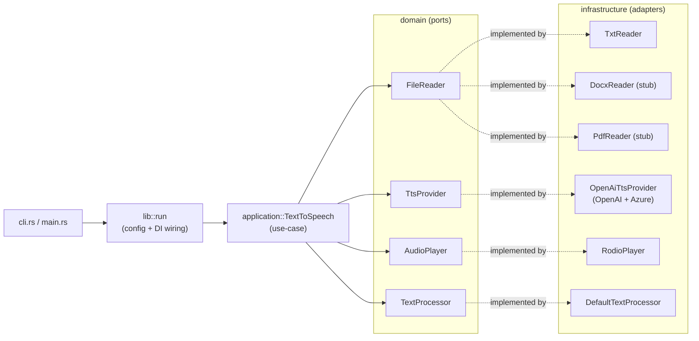

# TxtTattler 🗣️

> The little gossip that reads your files out loud.

TxtTattler is a fun, lightweight, blazing-fast, cross-platform command-line
text-to-speech app written in Rust. Point it at a text file and it extracts the
text and reads it aloud using OpenAI's TTS models (with full Azure OpenAI
support). Generated audio is cached, so re-runs are instant and free.

```text
txttattler myfile.txt
```

---

## Features

- 🎧 **Reads `.txt` aloud** via OpenAI TTS (`tts-1`, `tts-1-hd`).
- 🎭 **Six voices**: alloy, echo, fable, onyx, nova, shimmer.
- ⚡ **Content-addressed MP3 cache** — same text + options ⇒ no repeat API calls.
- ☁️ **OpenAI _and_ Azure OpenAI** out of the box.
- ✂️ **Smart chunking** for long files (splits at paragraph/sentence boundaries,
  stitches the MP3 segments back together).
- 💾 **Save to disk** (`--output`), **skip playback** (`--no-play`), or both.
- 🎨 Colorful, emoji-flecked output with a progress bar.
- 🧱 **Hexagonal architecture** — adding `.docx`/`.pdf` later needs *zero*
  changes to the core.

---

## Installation

Requires a Rust toolchain (1.85+ for the 2024 edition) and, on Linux, the ALSA
development headers for audio playback (`libasound2-dev` on Debian/Ubuntu).

```bash
# From the project directory
cargo build --release

# The binary lands at:
./target/release/txttattler

# Optionally install it onto your PATH:
cargo install --path .
```

---

## Configuration

TxtTattler looks for credentials in this order (later overrides earlier):

1. The TOML config file.
2. A `.env` file in the current directory (loaded into the environment).
3. Real environment variables.

### Environment variables

| Variable                     | Purpose                                  |
| ---------------------------- | ---------------------------------------- |
| `OPENAI_API_KEY`             | Standard OpenAI key.                     |
| `AZURE_OPENAI_ENDPOINT`      | Azure resource endpoint (enables Azure). |
| `AZURE_OPENAI_API_KEY`       | Azure key.                               |
| `AZURE_OPENAI_DEPLOYMENT_ID` | Azure TTS deployment name (default `tts`). |
| `AZURE_OPENAI_API_VERSION`   | Optional Azure API version.              |

Drop an `.env` in your working directory (see `.env.example`) and you're set.

### Config file (`txttattler.toml`)

Looked up at `~/.config/txttattler/txttattler.toml` (or pass `--config`):

```toml
voice = "nova"
model = "tts-1-hd"
speed = 1.1
# cache_dir = "/custom/cache/path"

[openai]
# api_key = "sk-..."   # prefer the env var / .env for secrets

[azure]
# endpoint = "https://my-resource.openai.azure.com"
# deployment_id = "tts"
```

---

## Usage

```bash
# The basics
txttattler notes.txt

# Pick a voice, model and speed
txttattler -v onyx -m tts-1-hd -s 1.25 story.txt

# Save an MP3 and skip playback
txttattler --no-play -o story.mp3 story.txt

# Force a fresh render, ignoring the cache
txttattler --refresh notes.txt

# One-off render with no caching at all
txttattler --no-cache secret.txt

# Use Azure OpenAI
txttattler --azure report.txt

# Discover the voices, or get chatty diagnostics
txttattler --list-voices
txttattler -V notes.txt
```

### Options

| Flag                  | Description                                         |
| --------------------- | --------------------------------------------------- |
| `-v, --voice <VOICE>` | alloy \| echo \| fable \| onyx \| nova \| shimmer   |
| `-m, --model <MODEL>` | `tts-1` \| `tts-1-hd`                               |
| `-s, --speed <FLOAT>` | 0.25–4.0                                            |
| `-o, --output <PATH>` | Save the MP3 to this path                           |
| `--no-play`           | Generate/save but don't play                        |
| `--no-cache`          | Don't read or write the cache                       |
| `--refresh`           | Ignore the cache and regenerate                     |
| `--cache-dir <PATH>`  | Override the cache directory                        |
| `--azure`             | Force the Azure OpenAI endpoint                     |
| `--config <PATH>`     | Path to a TOML config file                          |
| `--list-voices`       | List voices and exit                                |
| `-V, --verbose`       | Chatty diagnostic output                            |

---

## Caching

Every successful render is written to a platform cache directory
(`~/.cache/txttattler/` on Linux, the equivalent on macOS/Windows). The cache
key is a SHA-256 of the **cleaned text + voice + model + speed + a cache-version
string** — it is content-based, never filename-based, so renaming a file or
having two files with identical content reuses the same audio. Bumping
`CACHE_VERSION` in `src/utils.rs` transparently invalidates stale entries.

---

## Architecture

TxtTattler follows a clean **hexagonal (ports & adapters)** design. The
use-case depends only on traits; concrete adapters plug in at the edges.



```text
src/
├── main.rs                      # thin binary: parse args, pretty-print errors
├── lib.rs                       # module wiring + run() + ConsoleReporter (UI)
├── cli.rs                       # clap CLI definition + ASCII banner
├── config.rs                    # TOML config loading
├── utils.rs                     # chunking, cache keys, text cleanup, MP3 join
├── adapters.rs                  # FileReaderRegistry (extension → reader)
├── domain/
│   ├── entities.rs              # Voice, TtsModel, TtsOptions, CacheKey
│   └── ports.rs                 # FileReader, TextProcessor, TtsProvider, AudioPlayer
├── application/
│   └── text_to_speech.rs        # the use-case + ProgressReporter trait
└── infrastructure/
    ├── file_readers/{txt,docx,pdf}.rs
    ├── tts/openai.rs            # OpenAI + Azure TTS
    └── audio/player.rs          # rodio playback
```

---

## Adding a new file reader (e.g. `.docx`)

Thanks to the registry, this is the *only* place you touch:

1. Implement the port in `src/infrastructure/file_readers/docx.rs`:

   ```rust
   impl FileReader for DocxReader {
       fn read(&self, path: &Path) -> anyhow::Result<String> {
           // use the `docx`/`docx-rs` crate to pull out the body text
       }
   }
   ```

2. Register it in `src/adapters.rs`:

   ```rust
   registry.register("docx", Arc::new(DocxReader));
   ```

That's it. The use-case, CLI, caching and playback are untouched — they only
ever see a `String` of text.

---

## Development

```bash
cargo test            # unit + integration tests (mocked adapters, no network)
cargo clippy --all-targets
cargo build --release
```

The integration tests in `tests/integration.rs` swap in fake `FileReader`,
`TtsProvider` and `AudioPlayer` implementations, so the full pipeline
(caching, chunking, output, playback gating) is verified without an API key or
a sound card.

---

## License

MIT — see [`LICENSE`](LICENSE).
