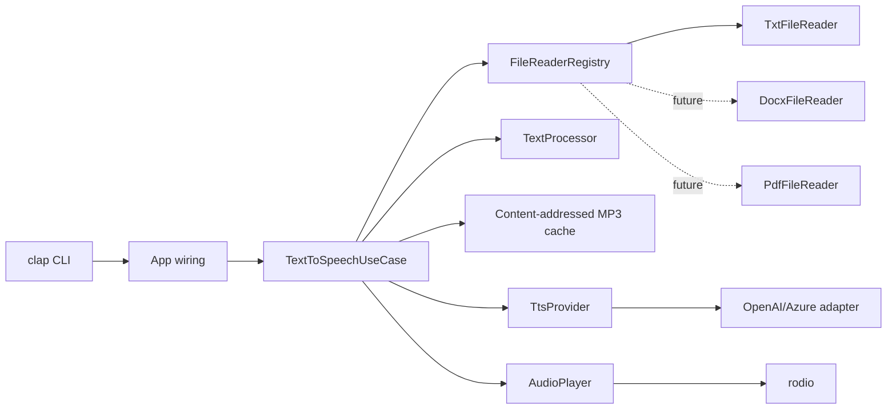

# TxtTattler

TxtTattler is a small Rust CLI that reads a text file and turns it into speech through OpenAI or Azure OpenAI TTS.

```bash
txttattler myfile.txt
txttattler myfile.txt --voice nova --model tts-1-hd --speed 1.1 --output narration.mp3
txttattler myfile.txt --no-play --output narration.mp3
```

## Install

```bash
cargo build --release
./target/release/txttattler --help
```

Set credentials through your shell, a `.env` file in the current directory, or `txttattler.toml`.

```bash
OPENAI_API_KEY=sk-...
```

Azure mode needs:

```bash
AZURE_OPENAI=1
AZURE_OPENAI_ENDPOINT=https://your-resource.openai.azure.com
AZURE_OPENAI_API_KEY=...
AZURE_OPENAI_DEPLOYMENT_ID=your-tts-deployment
```

## Usage

```bash
txttattler <FILE> [OPTIONS]
```

Important options:

- `--voice alloy|echo|fable|onyx|nova|shimmer`
- `--model tts-1|tts-1-hd`
- `--speed 0.25..4.0`
- `--output narration.mp3`
- `--no-play`
- `--no-cache`
- `--refresh`
- `--cache-dir ./cache`
- `--azure`
- `--config ./txttattler.toml`
- `--list-voices`
- `--verbose`

## Config

Example `txttattler.toml`:

```toml
voice = "alloy"
model = "tts-1"
speed = 1.0
cache_dir = "/tmp/txttattler-cache"

[openai]
api_key = "sk-..."

[openai.azure]
enabled = false
endpoint = "https://your-resource.openai.azure.com"
api_key = "..."
deployment_id = "your-tts-deployment"
api_version = "2024-02-15-preview"
```

Environment variables override config file values.

## Architecture



The core use-case depends only on traits:

- `FileReader`
- `TtsProvider`
- `AudioPlayer`
- `TextProcessor`

Adding `.docx` or `.pdf` support should only require a new adapter plus one registry registration. The CLI and use-case do not need to know about file formats.

## Cache

TxtTattler caches MP3 output by SHA-256 of:

- cleaned text
- voice
- model
- speed
- text-processing version

That means a repeated run with identical content avoids another TTS API call. `--refresh` regenerates and replaces cache. `--no-cache` skips cache reads and writes.

## Development

```bash
cargo fmt
cargo test
cargo run -- --list-voices
```

The TTS adapter calls the network only during real synthesis. Unit and CLI tests do not require OpenAI credentials.
