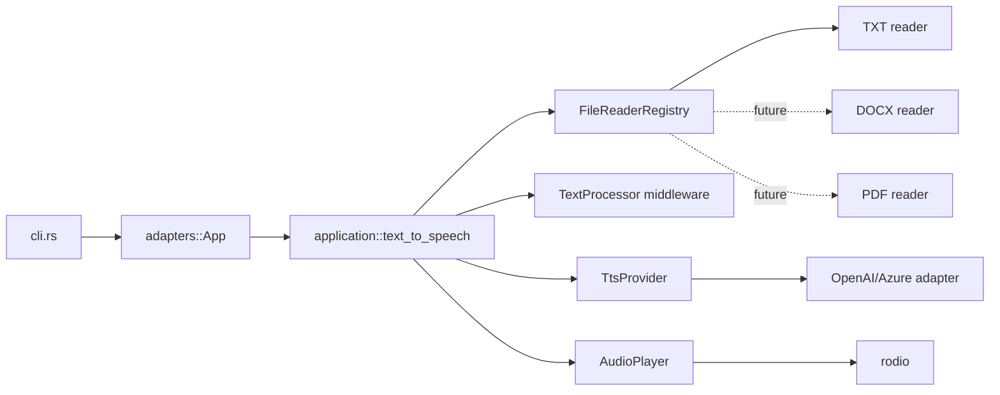

# TxtTattler

TxtTattler is a fast, lightweight Rust CLI that reads text files aloud with OpenAI TTS or Azure OpenAI.

```bash
txttattler notes.txt
txttattler notes.txt --voice nova --speed 1.2
txttattler notes.txt --output notes.mp3 --no-play
txttattler --list-voices
```

By default TxtTattler caches generated MP3 files, so replaying the same text with
the same voice, model, and speed avoids another OpenAI request.

```bash
txttattler notes.txt            # generate, cache, and play
txttattler notes.txt            # reuse cached MP3 and play
txttattler notes.txt --refresh  # regenerate and replace the cache
txttattler notes.txt --no-cache # one-off generation
```

## Install

```bash
cargo build --release
./target/release/txttattler notes.txt
```

Set credentials with environment variables:

```bash
export OPENAI_API_KEY="sk-..."
```

Or put them in a local `.env` file when running from the project directory:

```dotenv
OPENAI_API_KEY=sk-...
```

For Azure OpenAI:

```bash
export AZURE_OPENAI_ENDPOINT="https://your-resource.openai.azure.com"
export AZURE_OPENAI_API_KEY="..."
export AZURE_OPENAI_DEPLOYMENT_ID="your-tts-deployment"
txttattler notes.txt --azure
```

## Config

TxtTattler looks for `txttattler.toml` under your platform config directory, for example `~/.config/txttattler/txttattler.toml` on Linux.

```toml
[openai]
api_key = "sk-..."

[azure]
endpoint = "https://your-resource.openai.azure.com"
api_key = "..."
deployment_id = "your-tts-deployment"
api_version = "2024-02-15-preview"
```

Environment variables override the config file.

## Cache

The automatic MP3 cache lives in your platform cache directory, usually
`~/.cache/txttattler/` on Linux. The cache key includes the cleaned text
contents, voice, model, speed, and a cache version, so edited text or changed
settings regenerate correctly.

Use `--cache-dir <PATH>` to override the cache location. Use `--output <PATH>`
when you also want a visible MP3 file in a specific place.

## Architecture



To add a new file type, implement `domain::ports::FileReader` in `infrastructure/file_readers`, then register the extension in `adapters::App`. The use case and CLI do not change.

## Notes

Version 1 supports `.txt` files with UTF-8 and UTF-8 BOM. Long text is chunked below the OpenAI TTS input limit and the MP3 segments are concatenated for playback or saving.
