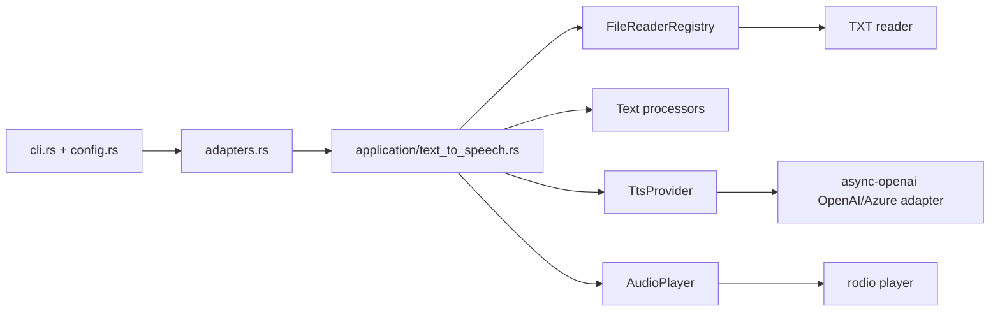

# TxtTattler

TxtTattler is a fast, playful Rust CLI that reads text files out loud with OpenAI text-to-speech. It uses a ports-and-adapters layout so new readers, processors, and TTS backends can be added without touching the core use case.

## Features

- `txttattler <FILE>` command with `clap`-powered help and sensible defaults
- OpenAI and Azure OpenAI TTS support through `async-openai`
- Content-based MP3 cache keyed by file content, voice, model, speed, and pipeline version
- `.env`, environment-variable, and TOML config loading
- Injectable text-processing middleware
- Cross-platform playback with `rodio`
- Unit and integration tests

## Installation

```bash
cargo build --release
```

The binary will be available at:

```bash
target/release/txttattler
```

## Configuration

TxtTattler loads configuration in this order:

1. Defaults
2. `txttattler.toml` from the default config directory or `--config <PATH>`
3. Environment variables
4. CLI flags

If a `.env` file exists in the current working directory, it is loaded before configuration resolution so it can populate the environment variables consumed by the app.

### OpenAI environment variables

```bash
OPENAI_API_KEY=...
OPENAI_BASE_URL=https://api.openai.com/v1
OPENAI_ORG_ID=...
OPENAI_PROJECT_ID=...
```

### Azure OpenAI environment variables

```bash
AZURE_OPENAI_ENDPOINT=https://your-resource.openai.azure.com
AZURE_OPENAI_API_KEY=...
AZURE_OPENAI_DEPLOYMENT=tts-deployment
AZURE_OPENAI_API_VERSION=2024-02-01
```

### Example `txttattler.toml`

```toml
voice = "nova"
model = "tts-1"
speed = 1.0
strip_markdown = true

[openai]
api_key = "sk-..."

[azure_openai]
endpoint = "https://your-resource.openai.azure.com"
deployment = "tts-deployment"
api_key = "..."
api_version = "2024-02-01"
```

## Usage

```bash
txttattler chapter.txt
txttattler chapter.txt --voice shimmer --model tts-1-hd --speed 1.15
txttattler chapter.txt --output chapter.mp3 --no-play
txttattler chapter.txt --refresh
txttattler --list-voices
txttattler chapter.txt --azure
```

## Architecture



## Adding a new file reader

1. Add a new adapter under `src/infrastructure/file_readers/`, for example `docx.rs`.
2. Implement the `domain::ports::FileReader` trait.
3. Register the reader in `adapters.rs` with `registry.register("docx", Arc::new(DocxFileReader::default()));`

No CLI or use-case changes are required because the `FileReaderRegistry` resolves the reader by file extension.
