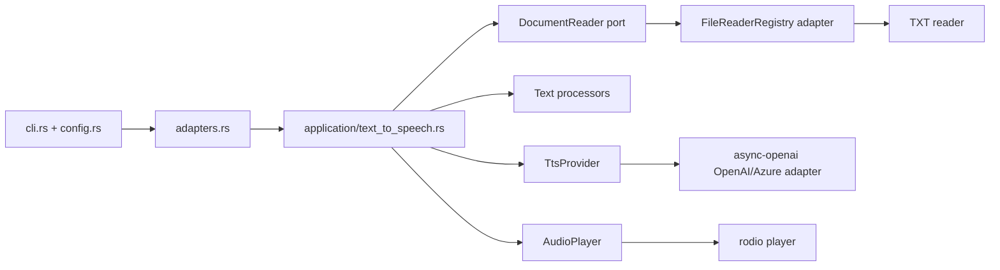

# TxtTattler

TxtTattler is a fast, playful Rust CLI that reads text files out loud with OpenAI text-to-speech. It uses a ports-and-adapters layout so new readers, processors, and TTS backends can be added without touching the core use case.

## Features

- `txttattler <FILE>` command with `clap`-powered help and sensible defaults
- OpenAI and Azure OpenAI TTS support through `async-openai`
- OpenAI `tts-1`, `tts-1-hd`, and `gpt-4o-mini-tts` model support
- Thirteen built-in voices: `alloy`, `ash`, `ballad`, `coral`, `echo`, `fable`, `onyx`, `nova`, `sage`, `shimmer`, `verse`, `marin`, and `cedar`
- Optional `--instructions <TEXT>` guidance for language, accent, tone, and style with `gpt-4o-mini-tts`
- Content-based MP3 cache keyed by file content, voice, model, speed, instructions, and pipeline version
- `.env`, environment-variable, and TOML config loading with CLI-over-env-over-config precedence
- Injectable text-processing middleware
- Cross-platform playback with `rodio`
- Unit and integration tests

## Installation

```bash
cargo build --release
```

The binary will be available at:

```bash
target/release/txttattler
```

## Configuration

TxtTattler resolves configuration in this order:

1. CLI flags
2. Supported environment variables
3. `txttattler.toml` from the default config directory or `--config <PATH>`
4. Built-in defaults

If a `.env` file exists in the current working directory, it is loaded before configuration resolution. When the current directory has no `.env`, TxtTattler falls back to `{CARGO_MANIFEST_DIR}/.env`, which is useful during local development.

### TxtTattler environment variables

```bash
TXT_TATTLER_VOICE=nova
TXT_TATTLER_MODEL=gpt-4o-mini-tts
TXT_TATTLER_SPEED=1.15
TXT_TATTLER_INSTRUCTIONS=Speak in Dutch with a warm tone.
TXT_TATTLER_CACHE_DIR=/tmp/txttattler-cache
TXT_TATTLER_VERBOSE=true
TXT_TATTLER_STRIP_MARKDOWN=true
TXT_TATTLER_AZURE=false
```

### OpenAI environment variables

```bash
OPENAI_API_KEY=...
OPENAI_BASE_URL=https://api.openai.com/v1
OPENAI_ORG_ID=...
OPENAI_PROJECT_ID=...
```

### Azure OpenAI environment variables

```bash
AZURE_OPENAI_ENDPOINT=https://your-resource.openai.azure.com
AZURE_OPENAI_API_KEY=...
AZURE_OPENAI_DEPLOYMENT=tts-deployment
AZURE_OPENAI_API_VERSION=2024-02-01
```

Azure mode is selected when `--azure`, `TXT_TATTLER_AZURE=true`, or `azure = true` is set. If no OpenAI key is present and `AZURE_OPENAI_ENDPOINT` is available, TxtTattler also auto-selects Azure. When both OpenAI and Azure environment values are present, standard OpenAI wins unless Azure is explicitly enabled.

### Example `txttattler.toml`

```toml
voice = "nova"
model = "gpt-4o-mini-tts"
speed = 1.0
instructions = "Speak in Dutch with a warm tone."
strip_markdown = true

[openai]
api_key = "sk-..."

[azure_openai]
endpoint = "https://your-resource.openai.azure.com"
deployment = "tts-deployment"
api_key = "..."
api_version = "2024-02-01"
```

## Usage

```bash
txttattler chapter.txt
txttattler chapter.txt --voice shimmer --model tts-1-hd --speed 1.15
txttattler chapter.txt --model gpt-4o-mini-tts --instructions "Speak in Dutch."
txttattler chapter.txt --voice cedar --model gpt-4o-mini-tts --instructions "Use a calm narrator voice."
txttattler chapter.txt --output chapter.mp3 --no-play
txttattler chapter.txt --refresh
txttattler chapter.txt --no-cache --output one-off.mp3 --no-play
txttattler --list-voices
txttattler chapter.txt --azure
```

Use `--instructions` with `gpt-4o-mini-tts` to steer spoken language and delivery independently of the input text, for example `--instructions "Speak in Dutch."`. TxtTattler warns when instructions are used with `tts-1` or `tts-1-hd`, because those models do not support the field. It also warns when non-default `--speed` is used with `gpt-4o-mini-tts`.

By default, repeated runs with the same processed text, voice, model, speed, instructions, and processor pipeline reuse the cached MP3 and skip the TTS request. Use `--refresh` to regenerate and atomically replace a cache entry. Use `--no-cache` for one-off generation; combine it with playback or `--output` so the run has somewhere to send the generated audio.

## Architecture



## Adding a new file reader

1. Add a new adapter under `src/infrastructure/file_readers/`, for example `docx.rs`.
2. Implement the `domain::ports::FileReader` trait.
3. Register the reader in `adapters.rs` with `registry.register("docx", Arc::new(DocxFileReader::default()));`

No CLI or use-case changes are required. The use-case depends on the `DocumentReader` domain port, and `FileReaderRegistry` stays in infrastructure as the extension-based adapter.
